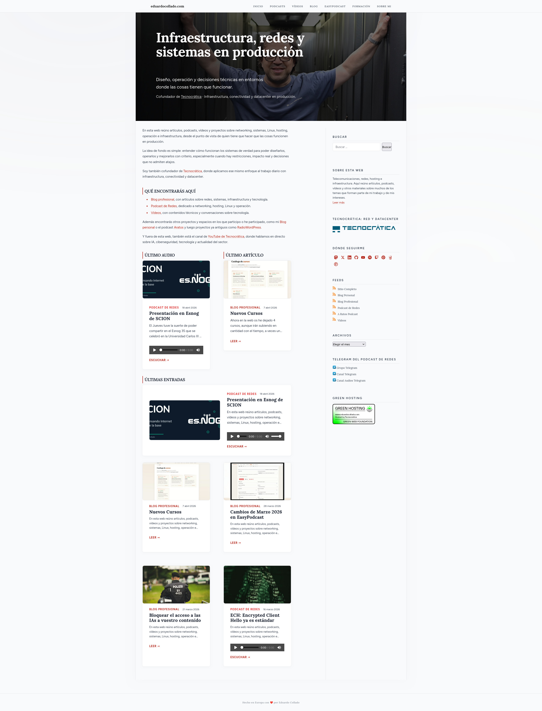

# wp-edu-theme


Tema WordPress a medida para [eduardocollado.com](https://eduardocollado.com) — blog personal y podcast sobre redes, tecnología y aprendizaje.

---

## Preview



---

## Características

- **Diseño propio** — paleta cálida (crema + terracota), tipografía editorial con Fraunces, Figtree e IBM Plex Mono
- **Blog + Podcast** — posts normales y episodios de podcast conviven con layouts diferenciados
- **Tabla de contenidos automática** — el JS escanea los `h2`/`h3` del artículo y genera el TOC dinámicamente
- **Navegación personalizada** — walker propio con soporte de submenús y toggle mobile
- **Sin dependencias de JS externas** — vanilla JS puro, sin jQuery
- **Tamaños de imagen optimizados** — `edu-card` (640×360), `edu-hero` (1200×500), `edu-thumb` (80×80)
- **Compatible con el editor de bloques** — soporte para `wp-block-styles` y `editor-styles`

---

## Diseño

### Paleta de color

| Token | Valor | Uso |
|---|---|---|
| `--color-bg-primary` | `#f6f2eb` | Fondo principal |
| `--color-bg-secondary` | `#eee8dc` | Fondo secundario |
| `--color-bg-card` | `#fdfaf5` | Fondo de tarjetas |
| `--color-accent-primary` | `#b5470e` | Terracota — acento principal |
| `--color-accent-secondary` | `#e06c35` | Terracota claro |
| `--color-text-primary` | `#1c1814` | Texto principal |
| `--color-text-secondary` | `#7a6f68` | Texto secundario |

### Tipografía

| Rol | Familia | Uso |
|---|---|---|
| `--font-display` | Fraunces | Títulos y cabeceras |
| `--font-body` | Figtree | Texto corrido y UI |
| `--font-code` | IBM Plex Mono | Código y elementos técnicos |

---

## Estructura

```
wp-edu-theme/
├── style.css                  # Todo el CSS (variables, reset, componentes)
├── functions.php              # Setup, enqueue, walkers y helpers
├── header.php                 # Cabecera y navegación principal
├── footer.php                 # Pie de página
├── front-page.php             # Homepage (hero + secciones podcast/blog)
├── single.php                 # Artículo individual
├── archive.php                # Listado de entradas / archivo
├── search.php                 # Resultados de búsqueda
├── page.php                   # Página estática
├── index.php                  # Fallback
├── 404.php                    # Página de error
├── sidebar.php                # Sidebar genérico
├── assets/
│   └── js/theme.js            # Nav toggle + TOC dinámico
└── template-parts/
    ├── content.php            # Card de entrada de blog
    ├── content-podcast.php    # Card de episodio de podcast
    ├── content-none.php       # Estado vacío
    └── sidebar-blog.php       # Sidebar del blog
```

---

## Shortcodes

### `[edu_recent_posts]`

Lista de entradas recientes con miniatura, título y fecha.

| Atributo | Por defecto | Descripción |
|---|---|---|
| `count` | `5` | Número de entradas a mostrar |
| `title` | — | Título de la sección |
| `category` | — | Slug o ID de categoría para filtrar |
| `orderby` | `date` | Criterio de ordenación (`date`, `title`, `rand`…) |

```
[edu_recent_posts count="3" title="Últimas entradas" category="podcast"]
```

---

### `[edu_latest_post]`

Destaca las últimas entradas con imagen hero + grid para el resto. Ideal para homepage o páginas de sección.

| Atributo | Por defecto | Descripción |
|---|---|---|
| `count` | `1` | Número de entradas |
| `title` | — | Título de la sección |
| `category` | — | Slug o ID de categoría |

```
[edu_latest_post count="4" title="Blog" category="redes"]
```

---

### `[edu_latest_audio]`

Muestra el último episodio de podcast con reproductor de audio integrado.

| Atributo | Por defecto | Descripción |
|---|---|---|
| `cat` | — | Slug o ID de categoría del podcast |
| `title` | — | Título de la sección |
| `img_position` | `right` | Posición de la imagen: `left` o `right` |

```
[edu_latest_audio cat="podcast" title="Último episodio" img_position="left"]
```

---

### `[edu_latest_article]`

Muestra el último artículo de una categoría con imagen a izquierda o derecha. Sin reproductor de audio.

| Atributo | Por defecto | Descripción |
|---|---|---|
| `category` | — | Slug o ID de categoría |
| `title` | — | Título de la sección |
| `img_position` | `right` | Posición de la imagen: `left` o `right` |

```
[edu_latest_article category="redes" title="Último artículo" img_position="right"]
```

---

### `[edu_social_icons]`

Renderiza los iconos de redes sociales configurados en **Apariencia → Personalizar → Redes Sociales**. No admite atributos.

```
[edu_social_icons]
```

---

## Instalación

1. Clona el repositorio en `wp-content/themes/`:

   ```bash
   git clone git@github.com:educollado/wp-edu-theme.git wp-content/themes/wp-edu-theme
   ```

2. Activa el tema desde **Apariencia → Temas** en el panel de WordPress.

3. Configura los menús desde **Apariencia → Menús**:
   - **Menú principal** (`primary`) — navegación de cabecera
   - **Menú footer** (`footer`) — enlaces del pie de página

4. Los episodios de podcast son posts asignados a la categoría **Podcast**.

---

## Requisitos

- WordPress 6.0 o superior
- PHP 8.0 o superior

---

## Changelog

### 1.0.0 — 2026-03-21
- Lanzamiento inicial del tema
- Soporte para blog y podcast
- Tabla de contenidos automática
- Navegación con walker personalizado
- Tamaños de imagen `edu-card`, `edu-hero` y `edu-thumb`

---

## Licencia

GPL v2 o posterior — ver [LICENSE](LICENSE).
